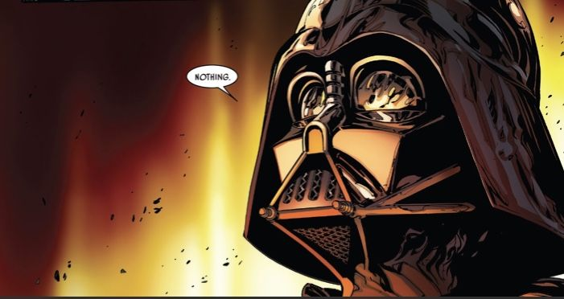

<!-- STAR WARS — "The Chosen One" README -->

<h1 align="center" style="color:#ffcc66; font-weight:900; text-shadow: 0 0 15px #ff9933;">
  ✨ Liel Stephen — The Chosen One ✨
</h1>

  

---

> *"A prophecy… that one will bring balance to the Force."*  
> — Jedi Archives

---

## 🌌 Who Am I?
I am **Yamala Liel Stephen**, a B.Tech **Artificial Intelligence & Machine Learning** student, training to master the algorithms that shape galaxies of data.  
Like the Chosen One, I strive to bring **balance between innovation and precision**.

---

## 🪐 Mission Log
- 🎓 **B.Tech in AI & ML** — VIT-AP University (2023–2027)
- 🛠 Forging projects like a kyber crystal — precise and powerful.
- ⚔️ Exploring the Light Side of ethical AI and the Dark Side of raw computational power.
- 🤝 Collaborating with other Jedi developers to build galaxy-scale applications.

---

## 🚀 Arsenal
- **Languages:** Java, C++, Python  
- **Frameworks & Tools:** React, Flask, Tailwind CSS, Git, pandas, NumPy  
- **Specializations:** Machine Learning, System Design, Full-Stack Development  
- **Certifications:** SQL (HackerRank), AI Basics (Intel), UiPath Automation
---

## ⚡ Fun Fact
I once debugged a bug so deep, even Yoda would've said:  
> *"Powerful, your stack trace is."*

---

<h3 align="center" style="color:#ffcc66;">
  ✨ May the Code — and the Force — Be With You ✨
</h3>
